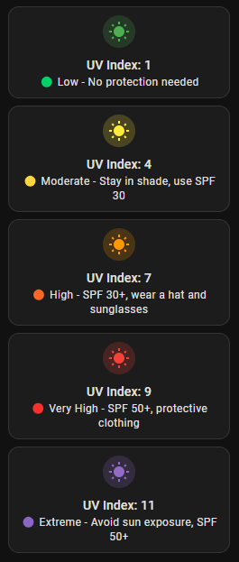

# Home Assistant UV Index


HAOS UV Index is a professional Lovelace UI card for Home Assistant that displays the real-time UV Index based on data from sensor.outdoor_uv_index. The card provides color-coded risk levels and protection recommendations according to WHO guidelines. It uses Mushroom Cards for a modern and clean design, making it easy to assess UV exposure at a glance.

- [Home Assistant UV Index](#home-assistant-uv-index)
  - [Why Use This Card?](#why-use-this-card)
  - [Features](#features)
  - [Requirements](#requirements)
  - [Installation](#installation)
  - [Lovelace YAML](#lovelace-yaml)
  - [WHO UV Protection Guidelines](#who-uv-protection-guidelines)
  - [Contribution](#contribution)
  - [License](#license)

## Why Use This Card?

Monitoring UV radiation is crucial for protecting your skin from harmful sun exposure. This card helps you stay informed about the current UV Index and provides actionable recommendations to minimize risks. Whether you're planning outdoor activities or just want to stay safe, this card is an essential addition to your Home Assistant setup.

## Features

- Displays real-time **UV Index** from `sensor.outdoor_uv_index`  
- **Color-coded risk level** (Green, Yellow, Orange, Red, Purple)  
- Shows **WHO protection recommendations** 
- **Simple and professional** Lovelace design  

## Requirements

- **Home Assistant OS (HAOS)**  
- **HACS installed**  
- **Mushroom Cards** (via HACS → Frontend → "Mushroom Cards")  

## Installation

1. Install **Mushroom Cards** in HACS  
2. Add the following Lovelace YAML to your **Dashboard**  

## Lovelace YAML

```yaml
type: custom:mushroom-template-card
primary: "UV Index: {{ states('sensor.outdoor_uv_index') }}"
secondary: >
  
   🟢 Low - No protection needed
   🟡 Moderate - Stay in shade, use SPF 30
   🟠 High - SPF 30+, wear a hat and sunglasses
   🔴 Very High - SPF 50+, protective clothing
   🟣 Extreme - Avoid sun exposure, SPF 50+
  
icon: mdi:white-balance-sunny
icon_color: >
  
   green
   yellow
   orange
   red
   purple
  
layout: vertical
multiline_secondary: true
fill_container: true
```
## WHO UV Protection Guidelines

The World Health Organization (WHO) has published comprehensive guidelines for protection against UV radiation. These guidelines include measures that vary depending on the UV index, helping to minimize the risks of skin damage and sunburn.

For more information and detailed recommendations, refer to the official WHO guidelines:
[WHO UV Protection Guidelines](https://www.who.int/news-room/questions-and-answers/item/radiation-the-ultraviolet-(uv)-index)

## Contribution

Contributions to enhance this project are welcome! If you have suggestions, improvements, or bug fixes, please open an issue or submit a pull request.

## License

This project is licensed under the terms of the BSD 3-Clause License. See the [LICENSE](LICENSE) file for more details.